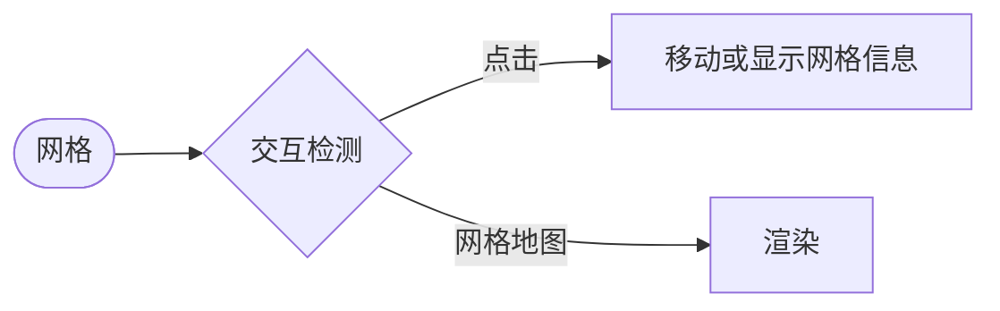

# hex grid system test
---
## 六边形网格系统测试
>使用Godot引擎制作的六边形网格系统（包括网格交互和地图瓦片集）
>Testing the Hexagonal Grid System Created in Godot

## 建议使用Git上传项目
>Git官网：[点击前往](https://git-scm.com/downloads)

## Git命令
```bush
git init //初始化Git
git add . //将文件加入暂存区
git statu //查看暂存区文件状态
git commit -m "任意字符" //提交暂存区文件
git push
git remote add origin https://github.com/用户名/仓库名.git //添加远程仓库
仓库链接：https://github.com/Whitewoolblock/hex_grid_system_test
```

## 任务清单
- [x] 六边形网格渲染
- [x] 地图瓦片集绘制
- [x] 基本交互逻辑
- [0] 摄像机移动

| 功能 | 支持情况 |
| --- | --- |
| 网格系统 | ❌ |
| 交互 | ❌ |
| 着色器 | ❌ |
## 留言
记得移除tscn文件，看看demo.zip
##回复
收到
